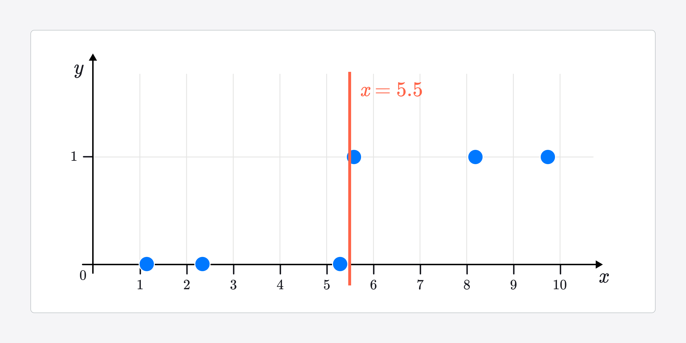
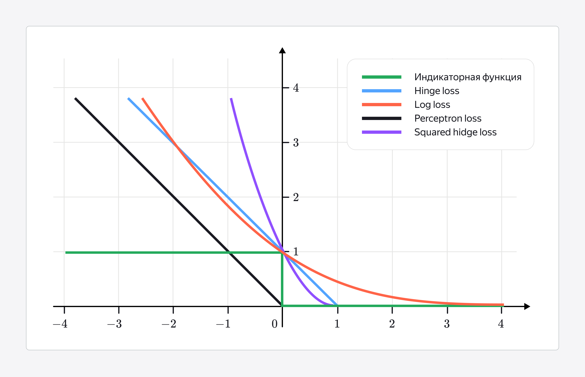

2026-03-25 13:07
tags: #машинное-обучение 

## Линейная бинарная классификация

Очень похожа на линейную регрессию. В основе своей использует ту же линейную формулу признаков.

Но! Она возвращает не непрерывное число. А знак. За чает функции `sign`
Возвращает -1 / 0 / 1

$$
y=sign(w₁⋅x₁+w₂⋅x₂+...+wₙ⋅xₙ+b)
$$
Отличие от регрессии - что нам нужно построить четкую границу между признаками, и то что с одной стороны - категория А, все что с другой - категория В. MSE для такой задачи не очень подходит, потому что пытается оптимизировать непрерывную линию. Также - если категории очень отличаются, то для MSE они как выбросы и она будет смещена в сторону этих выбросов.

Вся задача линейной классификации — это поиск такой гиперплоскости, которая наилучшим образом разделяет объекты разных классов. [Гиперплоскость](Гиперплоскость.md)

## Функция ошибок

Есть несколько ключевых понятий в этом:

Основной критерий качества - минимизация количества ошибок 

мы просто считаем сколько раз функция ошиблась.
1) На каждой итерации проверяем - соответствует ли знак предсказания правде
2) Если соответствует ставим 0, если нет 1
3) Суммируем единицы
4) Получаем количество ошибок

**Индикаторная функция**: Она проверяет выражение внутри себя и возвращает 1, если верно и 0, если не верно. Выражение любое. В нашем случае верно ли указан знак.

**Отступ** - насколько далеко предсказание от границы. Он тоже может участвовать в функции потерь, потому что хорошо бы начертить такую границу, чтобы все элементы находились от нее как можно дальше.

Отступ - чтобы мы могли интерпретировать отступы - его везде масштабируют и приводят к значению от 0 до 1 с помощью сигмоиды [Сигмоидная функция (или сигмоида)](Сигмоидная%20функция%20(или%20сигмоида).md)

**Недифференцируемость** - когда функция имеет резкий скачек в 0. К ней нельзя построить производную.

[Формализация ошибки в задаче линейной классификации — Яндекс Практикум](https://practicum.yandex.ru/learn/data-scientist-plus/courses/d29ba637-7160-435d-a747-755b3f3b53d0/sprints/912517/topics/5111ff49-d931-41e5-bc02-81e4519e9f18/lessons/7e9c0bad-e616-4d38-b7ad-8b98fcc60db1/)
### Проблема 

Но с простым подходом есть проблема. Многие модели обучаются градиентными методами [Градиентный спуск](Градиентный%20спуск.md), и для этого их нужна производная в каждой точке - нужно понять куда идет градиент. А если наша функция идет резкими скачками - то то нельзя построить градиент.

Придумали просто заменять ступенчатую функцию, но метод верхней оценки [МО - Метод верхней оценки](МО%20-%20Метод%20верхней%20оценки.md)

Функций разных много. Мы используем Log loss, описана в [МО - Функция потерь](МО%20-%20Функция%20потерь.md)

Выглядит так

## Логистическая регрессия

**Логистическая регрессия (или логрег)** — это модель, которая строит линейную комбинацию признаков (иначе говоря — складывает признаки, умноженные на веса) и применяет к этой сумме специальную функцию — сигмоиду.

- **Знак веса** (положительный или отрицательный) показывает, в какую сторону признак влияет на вероятность принадлежности к положительному классу.
- **Модуль веса** (его абсолютная величина) показывает, как сильно признак влияет на результат.
## Вероятность в логистической регрессии

1) Логистическая регрессия крута тем, что может предсказывать не только к какому из 2-х классов принадлежит объект, но и насколько она уверена в этом.

Но тут есть нюанс - уверенность модели строится на других таких же объектах. Это не настоящая вероятность, а скорее, наибольшая вероятность среди объектов с такими же признаками.

Пример. Если модель предсказывает, что яблоко будет красным с вероятностью 0.45, это значит: если бы было 100 яблок, для которых модель дала такое предсказание, примерно 45 из них действительно оказались бы красными. То есть модель как бы говорит: «В среднем, при таких признаках 45% объектов относятся к этому классу».

2) Модель предсказывает вероятность для категории `1`. И мы может подтюнить ее для категории `1`. А для второй категории - не можем

3) Логистическая регрессия по умолчанию всегда выдает калиброванную вероятность [Калиброванная и некалиброванная вероятность](Калиброванная%20и%20некалиброванная%20вероятность.md)

