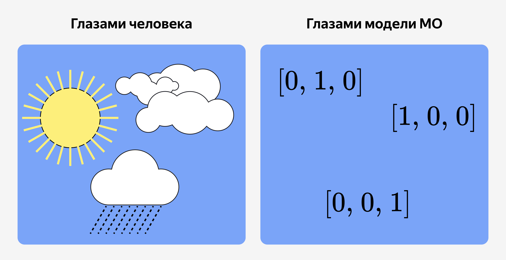

2026-03-24 17:23
tags: #машинное-обучение 

Основные принципы:
1. Сохранение информации: закодированные данные должны отражать различия между категориями.
2. Корректность для модели: числа, соответствующие значениям признака, не должны вводить алгоритм в заблуждение (как в примере с городами).
3. Гибкость: метод должен подходить для категорий с разным количеством уникальных значений: от двух (например, «мужчина/женщина») до сотен (например, «название улицы»).

## Основные методы кодирования категорий

Лучше One-Hot Encoding
- если у признака небольшое количество уникальных значений (например, день недели);  
- если важно сохранить простую интерпретацию признаков, т. е. возможность понять, какая категория сработала;  
- если в датасете нет целевой переменной.

Лучше Target Encoding
- если категорий очень много (сотни или тысячи);  
- если важна связь категорий с целевой переменной;  
- есть возможность заранее поделить выборку на обучающую и тестовую.

### One-Hot Encoding

«превращает» каждую категорию в отдельный бинарный признак (0 или 1).

Пример входных данных:

|**дата**|**погода**|
|---|---|
|01-07-1999|солнечно|
|02-07-1999|облачно|
|03-07-1999|дождливо|
|04-07-1999|солнечно|
Пример выходных данных

| **дата**   | **погода (исходный признак)** | **погода_солнечно** | **погода_облачно** | **погода_дождливо** |
| ---------- | ----------------------------- | ------------------- | ------------------ | ------------------- |
| 01-07-1999 | солнечно                      | 1                   | 0                  | 0                   |
| 02-07-1999 | облачно                       | 0                   | 1                  | 0                   |
| 03-07-1999 | дождливо                      | 0                   | 0                  | 1                   |
| 04-07-1999 | солнечно                      | 1                   | 0                  | 0                   |
|            |                               |                     |                    |                     |

One-Hot Encoding — простой и понятный алгоритм. Но есть нюанс: если оставить все три столбца, между ними появится сильная взаимосвязь (называется мультиколлинеарностью). [МО - Мультиколлинеарность](МО%20-%20Мультиколлинеарность.md)

Для линейных моделей (например, линейной регрессии [МО - линейная регрессия](МО%20-%20линейная%20регрессия.md)) это может привести к ошибкам в расчётах и нестабильным результатам. Такой случай называется **дамми-ловушкой** (dummy variable trap).

Чтобы этого избежать, обычно один из новых столбцов просто убирают. Линейная модель всё равно сможет понять, какой был цвет по оставшимся столбцам.

Многие современные библиотеки делают это автоматически, или в простых задачах с небольшим количеством категорий это не вызывает серьёзных проблем. Тем не менее важно знать о дамми-ловушке, чтобы в будущем избегать ошибок при работе с линейными моделями и большими наборами данных.

#### Недостатки
- Увеличение размерности. Особенно на больших категориях - 1000 городов, добавят 1000 новых столбцов
- Разряженность - когда большинство значений 0, то некоторые модели могут теряться и плохо их обрабатывать
- При кодировании мы фиксируем количество категорий. Но если в новых данных будет новая категория - то будет ошибка. ( поэтому новые категории либо кодируют в 0, либо игнорируют )
- Дамми - ловушка

Поэтому One-Hot Encoding применяют, если категорий от 10 до 15

### Target Encoding

Заменить категорию на число, которое отражает её связь с целевой переменной.
Библиотека: [Category Encoders — Category Encoders 2.8.1 documentation](https://contrib.scikit-learn.org/category_encoders/)
`TargetEncoder`

Как это делается:

1. Для каждой категории вычисляется статистика по целевой переменной (чаще всего — среднее значение).
2. Эта статистика подставляется вместо категории.

Входные данные

|**дата**|**погода**|**температура**|
|---|---|---|
|01-07-1999|солнечно|25|
|02-07-1999|облачно|18|
|03-07-1999|дождливо|14|
|04-07-1999|солнечно|22|
|05-07-1999|дождливо|15|
1. Найдём значения температуры для всех дней с солнечной погодой и посчитаем среднее. Также для каждой другой погоды.

Закодированные
2. Заменим категориальный признак новыми значениями.

|**дата**|**погода**|**погода_encoded**|**температура**|
|---|---|---|---|
|01-07-1999|солнечно|23.5|25|
|02-07-1999|облачно|18|18|
|03-07-1999|дождливо|14.5|14|
|04-07-1999|солнечно|23.5|22|
|05-07-1999|дождливо|14.5|15|
Когда мы кодируем категорию через среднее по целевой переменной, мы фактически отвечаем на вопрос: «Насколько эта категория связана с тем, что мы хотим предсказать?» Благодаря этому модель получает не просто «ярлык» категории, а число, которое показывает силу связи категории с целевой переменной. 

Если в исходных данных связь была сильной (например, «дождливо» почти всегда связано с низкой температурой), модель сможет это заметить.

НО! Тут важно понимать, что Иногда возможны ситуации, когда Target Encoding не может отразить истинную зависимость признака от целевой переменной. Например, летом солнечная погода действительно связана с высокой температурой, но зимой солнечные дни часто наступают при сильном морозе. Если посчитать среднее по всем «солнечным» дням без учёта сезона, то получится усреднённое искажённое значение, которое не будет верно ни для лета, ни для зимы. В таких случаях стоит добавить дополнительные признаки (например, «сезон») или использовать более сложные методы кодирования, чтобы сохранить реальную структуру данных.

#### Преимущества
- Эффективность при большом количестве категорий
- Сохранение информации о связи признака с целевой переменной

#### Недостатки
- Риск утечки данных - рассчитываем категории только на тестовой выборке
- Возможность переобучения - в каких-то категориях может быть 1-2 значения. И тогда наша модель может подстроиться под эти значения - они почти равны тергету.
- Сложно интерпрериовать. В One-Hot мы точно знаем к какой категории относимся. 
- Нам нужена целевая переменная. А она не всегда есть
