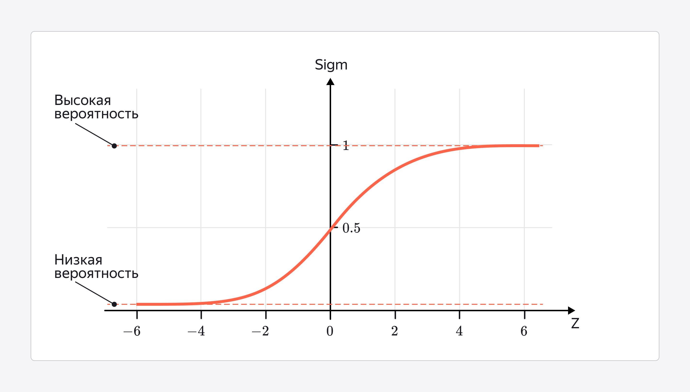

2026-03-25 15:28
tags: #

**Сигмоидная функция (или сигмоида)** — функция, принимающая на вход любое значение и возвращающая число от 0 до 1, которое можно трактовать как вероятность.

Название функции связано с латинской буквой «сигма». График сигмоиды имеет форму плавной S-образной кривой (по-английски — S-shaped curve).

