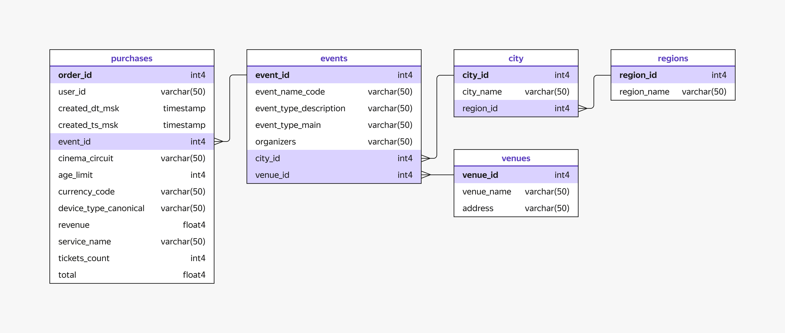

# Final Project: SQL and Python

This is the final project for the sprints on SQL and Python.

## Project Overview

In this project, you will work with real data from the Yandex Afisha service. Yandex Afisha allows users to discover events in various cities and purchase tickets for them. The service collaborates with event organizers and ticket operators who publish information and sell tickets.

The marketing team has set a goal: not just to attract new users but to retain them and turn them into loyal customers. To achieve this, the team aims to increase the proportion of clients who return after their first purchase to make additional purchases.

## Project Structure

The project consists of five parts, guiding you step-by-step from connecting to the data to the final publication of your work:

1. **Getting to Know the Data**
   - You will independently connect to the SQL database and perform an initial exploration of the data by answering several questions.
     

2. **Preparing for Data Export**
   - Solve several SQL tasks in the simulator. These tasks will help you prepare a query to export the data that you will later analyze using Python tools.

3. **Exploratory Data Analysis**
   - During this stage, you will:
     - Export data from the SQL database into a pandas DataFrame for further analysis using Python and data analysis libraries.
     - Perform data preprocessing.
     - Create a user profile by identifying features and factors that may influence repeat orders.
     - Analyze the data distribution and identify patterns.
     - Conduct a correlation analysis and calculate phik coefficients to determine which features influence the number of orders.

4. **Conclusions**
   - Based on the results of the exploratory data analysis, you will formulate recommendations for the business.

5. **Publishing the Project on Git**
   - Prepare the project for publication in a Git repository.
